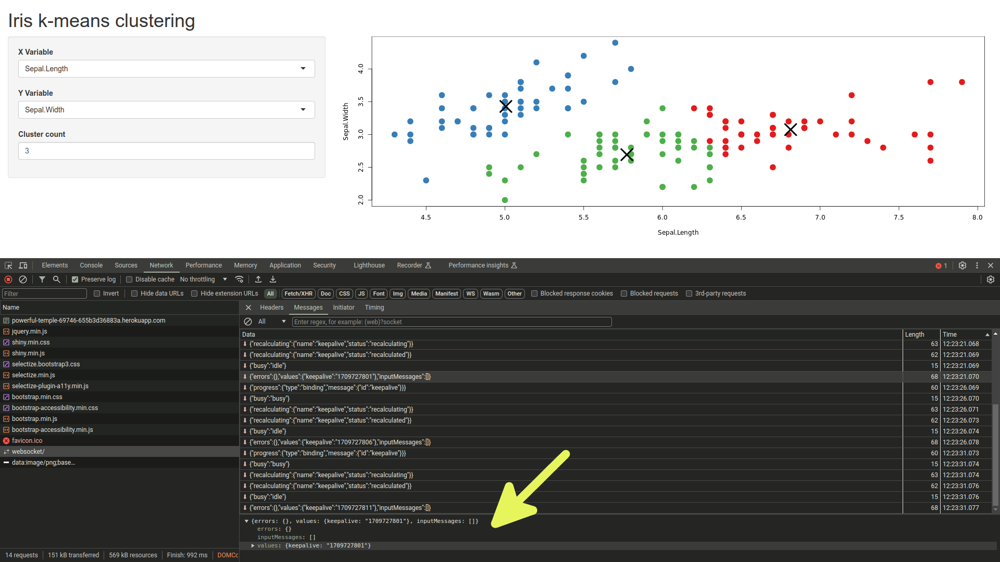

# Example Shiny App on Heroku

This is an example [Shiny][1] application, which uses [heroku-docker-r][2] for Heroku.

It implements logic to prevent websocket timeouts.

[](https://heroku.com/deploy)

You can use this project as a template for creating Shiny application on Heroku.

Execute these commands to get started:

```bash
# get the sources
git clone https://github.com/virtualstaticvoid/heroku-docker-r-websocket-test.git
cd heroku-docker-r-websocket-test

# optionally, reinitialize git
rm -rf .git
git init
git add --all
git commit -m "initial"

# create a new heroku application and deploye
heroku create --stack=container
git push heroku main

# view the application
heroku open
```

## Inspect HTTP Traffic

Use the Chrome Developer Tools to inspect the websocket traffic.



## License

MIT License. Copyright (c) 2024 Chris Stefano. See [MIT_LICENSE](MIT_LICENSE) for details.

[1]: https://shiny.rstudio.com
[2]: https://github.com/virtualstaticvoid/heroku-docker-r
